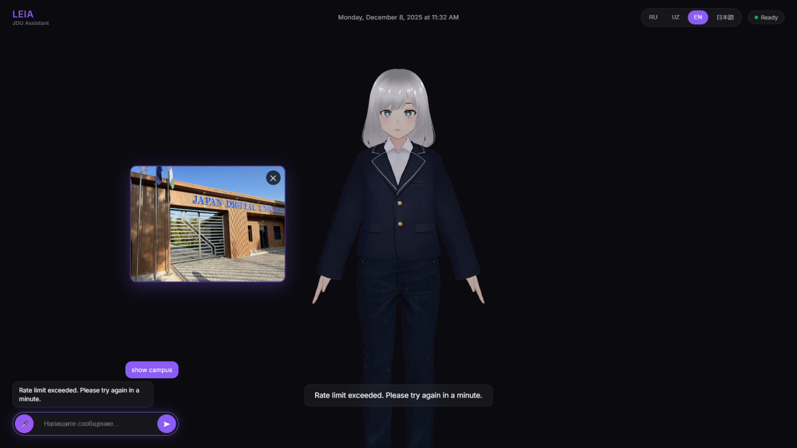

#    LEIA Assistant

<div align="center">



**3D AI-ассистент для Japan Digital University**

[](https://python.org)
[](https://fastapi.tiangolo.com)
[](https://threejs.org)
[](LICENSE)

[Демо](#-демо) • [Установка](#-установка) • [Возможности](#-возможности) • [Технологии](#️-технологии)

</div>

---

## 🌟 О проекте

**LEIA** (Living Educational Interactive Assistant) — это интерактивный 3D AI-ассистент, разработанный для помощи студентам, преподавателям и гостям Japan Digital University. 

LEIA отвечает на вопросы о университете, показывает расписание, помогает найти аудитории и многое другое — всё это с дружелюбным 3D аватаром, который понимает 4 языка! 

---

## ✨ Возможности

| Функция | Описание |
|---------|----------|
| 🎭 **3D Аватар** | Живой персонаж с 10 эмоциями и 9 анимациями |
| 🧠 **AI-ответы** | Интеграция с Google Gemini для умных ответов |
| 🌍 **4 языка** | Русский, Узбекский, English, 日本語 |
| 🎤 **Голос** | Распознавание речи и синтез голоса |
| 🖼️ **Визуализация** | Показ фото кампуса и аудиторий |
| ⚡ **Быстрый** | Мгновенные ответы 24/7 |

---

## 🎭 Эмоции и анимации

### Эмоции (10)

| Эмоция | Триггеры | Описание |
|--------|----------|----------|
| 😊 `happy` | рад, отлично, прекрасно | Радостное выражение |
| 😢 `sad` | извини, к сожалению | Грустное выражение |
| 🤔 `thinking` | думаю, возможно, хм | Задумчивое выражение |
| 😮 `surprised` | ого, вау, wow | Удивление |
| 🎉 `excited` | круто, супер, ура | Восторг |
| 😐 `neutral` | (по умолчанию) | Нейтральное выражение |
| 👋 `greeting` | привет, hello, salom | Приветствие |
| 👋 `farewell` | пока, goodbye, xayr | Прощание |
| 🙏 `grateful` | спасибо, thanks, rahmat | Благодарность |
| ✅ `agreeing` | понял, хорошо, ok | Согласие |

### Анимации (9)

| Анимация | Описание |
|----------|----------|
| 👋 `wave` | Помахать рукой |
| 🙇 `bow` | Японский поклон |
| 😊 `nod` | Кивок головой |
| 🤔 `thinking` | Рука у подбородка |
| 🗣️ `talking` | Жестикуляция при разговоре |
| 👆 `pointing` | Указывание рукой |
| 🎉 `happy_jump` | Радостный прыжок |
| 😌 `idle` | Покой с дыханием и морганием |
| 👁️ `blink` | Автоматическое моргание |

---

## 🎬 Демо

### Примеры команд:

```
👤: Привет! 
🤖: Привет!  Я LEIA, чем могу помочь?  
    [анимация: wave, эмоция: greeting]

👤: Спасибо за помощь! 
🤖: Всегда рада помочь! 
    [анимация: bow, эмоция: grateful]

👤: Покажи кампус
🤖: Вот наш прекрасный кампус! 
    [показывает фото]

👤: Круто! 
🤖: Спасибо!  
    [анимация: happy_jump, эмоция: excited]

👤: До свидания! 
🤖: До встречи!  Хорошего дня! 
    [анимация: bow, эмоция: farewell]
```

---

## 🚀 Установка

### Требования

- Python 3.11+
- Node.js 18+ (для dev-сервера)
- Google Gemini API ключ

### Backend

```bash
# Клонировать репозиторий
git clone https://github.com/GAMaksim/leia-assistant.git
cd leia-assistant

# Создать виртуальное окружение
cd backend
python -m venv venv
source venv/bin/activate  # Linux/Mac
venv\Scripts\activate     # Windows

# Установить зависимости
pip install -r requirements.txt

# Настроить переменные окружения
cp .env.example .env
# Добавить GEMINI_API_KEY в .env

# Запустить сервер
uvicorn app.main:app --port 8000
```

### Frontend

```bash
# Перейти в папку frontend
cd frontend

# Запустить локальный сервер
python -m http.server 3000
# или
npx serve -p 3000
```

### Открыть в браузере

```
http://localhost:3000
```

---

## 🛠️ Технологии

### Frontend
- **Three.js** — 3D графика и рендеринг
- **VRM** — формат 3D аватара  
- **GSAP** — плавные анимации
- **Web Speech API** — распознавание и синтез речи
- **Vanilla JavaScript** — без фреймворков

### Backend
- **FastAPI** — современный Python веб-фреймворк
- **Google Gemini AI** — генерация ответов
- **Pydantic** — валидация данных
- **Uvicorn** — ASGI сервер

---

## 📁 Структура проекта

```
leia-assistant/
├── backend/
│   ├── app/
│   │   ├── data/                 # JSON данные
│   │   │   ├── jdu_context.json  # Информация о JDU
│   │   │   ├── schedule.json     # Расписание
│   │   │   ├── staff.json        # Персонал
│   │   │   └── images.json       # Карта изображений
│   │   ├── routers/
│   │   │   ├── chat.py           # API чата
│   │   │   ├── speech.py         # API речи
│   │   │   └── avatar.py         # API аватара
│   │   ├── services/
│   │   │   ├── gemini_service.py # Интеграция с Gemini
│   │   │   ├── emotion_service.py# Анализ эмоций
│   │   │   ├── image_service.py  # Поиск изображений
│   │   │   └── speech_service.py # Обработка речи
│   │   ├── config.py
│   │   └── main.py
│   ├── requirements.txt
│   └── .env
├── frontend/
│   ├── css/
│   │   └── style.css
│   ├── js/
│   │   ├── app.js                # Главный файл
│   │   ├── vrm-loader.js         # Загрузка 3D модели
│   │   ├── animation-controller.js # 9 анимаций
│   │   ├── emotion-controller.js # 10 эмоций
│   │   ├── speech-handler.js     # Голос
│   │   └── presence-detector.js  # Детектор присутствия
│   ├── images/                   # Фото кампуса
│   ├── models/                   # VRM модель
│   └── index.html
└── README.md
```

---

## 🔧 API

### POST `/api/chat`

Отправить сообщение и получить ответ. 

**Запрос:**
```json
{
  "message": "Привет!",
  "language": "ru"
}
```

**Ответ:**
```json
{
  "response": "Привет! Я LEIA, чем могу помочь? ",
  "emotion": "greeting",
  "animation": "wave",
  "image": null
}
```

### Поддерживаемые эмоции в ответе:

| Эмоция | Анимация |
|--------|----------|
| `greeting` | `wave` |
| `farewell` | `bow` |
| `grateful` | `bow` |
| `agreeing` | `nod` |
| `happy` | `nod` |
| `excited` | `happy_jump` |
| `thinking` | `thinking` |
| `surprised` | `wave` |
| `sad` | `idle` |
| `neutral` | `talking` |

---

## 🌍 Поддерживаемые языки

| Код | Язык | Интерфейс | Распознавание | Эмоции |
|-----|------|-----------|---------------|--------|
| 🇷🇺 ru | Русский | ✅ | ✅ | ✅ |
| 🇺🇿 uz | O'zbek | ✅ | ✅ | ✅ |
| 🇬🇧 en | English | ✅ | ✅ | ✅ |
| 🇯🇵 ja | 日本語 | ✅ | ✅ | ✅ |

### Примеры триггеров эмоций на разных языках:

| Эмоция | 🇷🇺 Русский | 🇺🇿 O'zbek | 🇬🇧 English | 🇯🇵 日本語 |
|--------|-------------|------------|-------------|-----------|
| grateful | спасибо | rahmat | thanks | ありがとう |
| greeting | привет | salom | hello | こんにちは |
| farewell | пока | xayr | goodbye | さようなら |
| excited | круто | zo'r | awesome | やった |
| surprised | вау | voy | wow | すごい |

---

## 🚀 Планы развития

- [ ] 📅 Интеграция с реальным расписанием
- [ ] 🗺️ Интерактивная карта кампуса
- [ ] 💬 История диалогов (память)
- [ ] 📱 Мобильное приложение
- [ ] 🔊 Улучшенный узбекский TTS
- [ ] 🎭 Дополнительные анимации
- [ ] 🤖 Киоск в холле JDU

---

## 👨‍💻 Автор

**[Maksym]**

- GitHub: [@GAMaksim](https://github.com/GAMaksim)
- University: Japan Digital University

---

## 📄 Лицензия

MIT License — см.файл [LICENSE](LICENSE). 

---

<div align="center">

**⭐ Поставьте звезду, если проект понравился!**

Made with Maksym ❤️ for JDU

</div>
